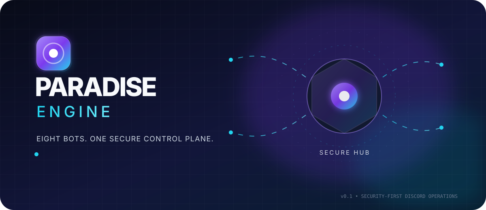
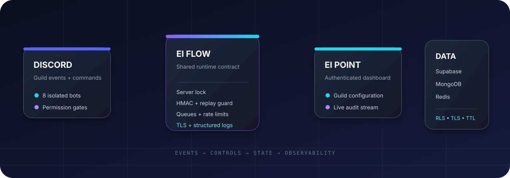

<div align="center">
  
</div>

<div align="center">

### A security-first Discord operations platform

Eight focused bots. One authenticated control plane. Three purpose-built data layers.

[](https://www.typescriptlang.org/)
[](https://discord.js.org/)
[](https://nextjs.org/)
[](https://supabase.com/)

<a href="https://github.com/peak-slavery/PARADISE">Repository</a> ·
<a href="#quick-start">Quick start</a> ·
<a href="#security-posture">Security</a> ·
<a href="#architecture">Architecture</a>

</div>

<br />

<div align="center">
  
  &nbsp;&nbsp;&nbsp;&nbsp;
  
</div>

## The idea

Ei Point Engine is a modular Discord platform for guilds that need more than a single all-purpose bot. Each capability runs as an isolated service, while `@eiflow/shared` provides the runtime contract for authorization, rate limits, queues, observability, data access, and failure handling.

The result is a system that can scale by responsibility instead of by complexity:

| Signal | Control | State |
| --- | --- | --- |
| Discord commands and events | Runtime permissions, guild lock, HMAC, rate limits | Supabase, MongoDB, Redis |
| Eight independent bot processes | Fail-closed authorization and bounded work | Authenticated dashboard and audit trail |

<div align="center">
  
</div>

## Fleet map

| Bot | Mission | Signature commands |
| --- | --- | --- |
| **Shanks** | Moderation | `/warn` · `/mute` · `/ban` · `/purge` |
| **Sanji** | Audit logging | `/setlogchannel` · `/logconfig` · `/message logs` |
| **Zoro** | Antinuke and threat response | `/antinuke` · `/whitelist` · `/lockdown` · `/scan` |
| **Boa Hancock** | Welcome automation | `/setwelcome` · `/setleave` · `/testwelcome` |
| **Nami** | XP and leveling | `/rank` · `/leaderboard` · `/setlevelchannel` |
| **Luffy** | Card game and inventory | `/play` · `/hand` · `/score` · `/inventory` |
| **Niko Robin** | Web search | `/search` |
| **Cyrene** | AI assistant | `/ask` · `/reset` · `/cyrene` |

## Architecture

```text
Discord guilds
    │
    ├── Shanks / Sanji / Zoro / Boa Hancock
    ├── Nami / Luffy / Niko Robin / Cyrene
    │       │
    │       └── @eiflow/shared
    │             ├── guild authorization + runtime permissions
    │             ├── HMAC request signing + replay protection
    │             ├── distributed rate limits + bounded queues
    │             ├── structured logs + Sentry + health checks
    │             └── Supabase + MongoDB + Redis clients
    │
    └── Ei Point dashboard
          ├── Supabase Auth and RLS-scoped ownership
          ├── guild configuration and setup readiness
          ├── live activity stream
          └── antinuke incident history
```

### Data plane

| Store | Responsibility | Guardrails |
| --- | --- | --- |
| **Supabase** | Auth, users, guild ownership, bot config, moderation, security events | RLS, protected authority fields, server-role isolation |
| **MongoDB Atlas** | High-volume logs, XP, games, inventories, AI context | TLS-only transport, guild-scoped indexes, TTL retention, document validation |
| **Upstash Redis** | Rate limits, antinuke counters, caches, provider cooldowns | Shared state, TTL expiry, fail-closed expensive operations |

## Security posture

Security is part of the runtime contract, not a dashboard feature.

- Sensitive Discord commands enforce permissions during execution, not only at registration.
- Guild authorization fails closed when a positive Supabase decision is unavailable.
- Existing guilds are reconciled at startup and every five minutes; revoked guilds are left.
- Background Discord event handlers use the same guild authorization boundary as commands.
- Internal bot configuration requests require a strong per-bot HMAC, timestamp, unique request ID, and authorized guild.
- HMAC request bodies are bounded and replayed request IDs are rejected atomically.
- Browser-facing dashboard queries use cookie-backed Supabase clients and RLS.
- Service-role access is isolated to the signed internal configuration route.
- Production OAuth canonical origins require HTTPS.
- MongoDB connections require encrypted transport.
- Redis/rate-limit failures do not silently become unlimited access to expensive providers.
- Queue timeouts retain concurrency slots until the underlying operation settles.
- Public health responses expose status only; detailed diagnostics require `HEALTH_TOKEN`.
- Structured logs redact authorization headers, tokens, URIs, provider keys, and service credentials.

## Quick start

### Requirements

- Node.js 22+
- npm 10+
- A Discord application and bot token for the service being run
- Supabase, MongoDB Atlas, and Upstash Redis for live mode

### Install

```bash
npm install
```

Create local environment files from the examples. They are intentionally ignored by Git:

```powershell
Copy-Item .env.example .env
Copy-Item dashboard\.env.example dashboard\.env.local
```

For an explicit UI preview without live credentials:

```env
DEMO_MODE=true
```

Demo mode is never enabled implicitly in production.

### Start the dashboard

```bash
npm run dev -w @eipoint/dashboard
```

Open `http://localhost:3000`.

### Start the local stack

For local production-shaped startup, the launcher reads `temp cred.txt` in memory and never copies its values into PM2 or source files. For a bounded test that always cleans up, use:

```powershell
npm run check:local
npm run test:local
pm2 status
```

The PM2 map runs the dashboard on port 3000 and the eight bots on ports 3101–3108. Every service has a `500M` memory restart threshold. PM2 on Windows cannot impose a hard `0.1 CPU core` quota; use a Windows Job Object, container, or VM if strict CPU isolation is required. The test runner binds the dashboard and bot health servers to `127.0.0.1`, refuses to start over an existing named service, and removes its nine named services before it exits.

Use `pm2 status`, `pm2 logs`, `pm2 restart all`, and `pm2 stop all` only for deliberately persistent local sessions. Save the process list only after verifying the local stack:

```powershell
pm2 save
```

### Start one bot

```bash
npm run dev -w @eiflow/bot-shanks
npm run dev -w @eiflow/bot-sanji
npm run dev -w @eiflow/bot-zoro
```

Every bot has its own workspace and deployment lifecycle. Use the matching workspace for the service you want to run.

### Initialize stores

Run database initialization with privileged credentials kept in your secret manager or local shell, never in source:

```bash
psql "$SUPABASE_DB_URL" -f infra/supabase/schema.sql
node scripts/apply-supabase-migrations.mjs --database-url="$SUPABASE_DB_URL"
mongosh "$MONGODB_URI" infra/mongo/init.js
```

Use the schema file only for a fresh database. The Node migration runner records
completed files in `private.schema_migrations` and applies each pending migration
transactionally. It refuses to run unless migration filenames form a contiguous
`0001`-based sequence, rejects a baseline that is not the first migration, aborts
if a baseline row already carries a different checksum, and fails if the ledger
references a migration that no longer exists in source. Mark an
already-initialized database once with `--baseline=0001_baseline.sql`; future
migrations then apply without re-running the baseline.

### Restore drill

The scheduled restore workflow exports a bounded Mongo batch, restores it into a
temporary isolated collection, verifies document parity and indexes, and always
cleans up. Configure the `restore-drill` GitHub environment with
`RESTORE_MONGODB_URI` and optional `RESTORE_MONGODB_DB`; use a dedicated
read/write staging database rather than production where practical.

After the first dashboard owner signs in once, provision that Supabase user as
the initial master through a service/admin database connection. The UUID is
supplied at runtime and is intentionally absent from Git:

```powershell
$env:MASTER_USER_ID = "<supabase-user-uuid>"
psql "$env:SUPABASE_DB_URL" -v master_user_id="$env:MASTER_USER_ID" -f infra/supabase/bootstrap-master.sql
```

## Environment contract

### Production-only rules

- Keep `DISCORD_TOKEN`, `SUPABASE_SERVICE_ROLE_KEY`, `MONGODB_URI`, Redis tokens, provider API keys, HMAC secrets, and `HEALTH_TOKEN` server-side.
- Use `HMAC_SECRETS_JSON` with one unique strong secret per bot in production.
- Use `mongodb+srv://` or an explicit TLS MongoDB URI.
- Set `NEXT_PUBLIC_SITE_URL` to an HTTPS origin in production.
- Apply the Supabase schema before enabling bot-to-dashboard synchronization.
- Require Redis when running more than one instance of a bot.

### Internal HMAC contract

The bot-to-dashboard configuration endpoint expects:

1. `Content-Type: application/json`
2. A body below the configured size limit
3. A recognized `bot_id`
4. A valid Discord `guild_id`
5. A unique `request_id`
6. A current timestamp and timing-safe HMAC signature
7. A guild present in Supabase with `authorized = true`

The legacy single `HMAC_SECRET` remains useful for local development only.

## Repository layout

```text
bots/                         Eight independent Discord services
dashboard/                    Next.js control plane
packages/shared/              Shared runtime and security primitives
infra/supabase/schema.sql     Tables, RLS, authority triggers, nonce storage
infra/mongo/init.js           Collections, indexes, TTL, validation rules
scripts/                      Retention and free-tier quota utilities
brand/                        Logos and README visual assets
.github/                      CI, dependency automation, quota workflow
```

## Validation

Run the complete local gate before publishing changes:

```bash
npm run typecheck
npm run lint
npm test
npm run build -w @eipoint/dashboard
npm audit
```

The shared security suite covers HMAC freshness and tamper detection, fail-closed rate limiting, queue timeout accounting, and encrypted MongoDB transport validation.

## Deployment notes

- Deploy bots independently so one process failure does not take down the fleet.
- Protect the retention workflow with least-privilege secrets and an approved environment.
- Keep detailed health diagnostics behind trusted monitoring infrastructure.
- Never expose Vite, Vitest UI, or development servers to untrusted networks.
- Rotate credentials if deployment history or external logs may have exposed them.

### Release gate

The canonical promotion sequence is:

1. Commit to a release candidate ref.
2. CI runs typecheck, lint, tests, build, audit, CodeQL, dependency review, and secret scan.
3. An operator manually dispatches `Release gate` against the approved `production-release` environment.
4. The gate repeats local validation and runs live production smoke.
5. Only after both jobs pass, promote Supabase migrations, dashboard deployment, and independent bot deployments.
6. Roll back the affected service and restore the matching database migration snapshot if any promotion step fails.

Before restoring a database snapshot, run:

```powershell
npm run drill:rollback -- --target=0001
```

The command resolves the exact migration, lists every later migration whose
checksum must be reverted from the snapshot, and fails on an unknown target.

### Monitoring and incidents

The `Production monitor` workflow runs every six hours and fails on any
degraded service, restart loop, or unavailable Supabase/Mongo/Redis dependency.
The dashboard uses `DASHBOARD_HEALTH_TOKEN`; all eight bot services use
`HEALTH_TOKEN`. Both are required only for authenticated
readiness diagnostics.
The weekly quota workflow alerts at 80% free-tier usage, and the restore drill
runs weekly. Investigate the named service, retain the failed workflow log,
check recent deployments and database migrations, roll back the affected
service, then rerun production smoke before closing the incident.

Run `npm run smoke:production` against an isolated production-shaped
environment before promotion. It requires the dashboard URL, service-role
Supabase credentials, Mongo and Redis connections, the complete per-bot
`HMAC_SECRETS_JSON` map, and a health URL for each of the eight bots.
The health token must be the trusted shared diagnostic token used by the bot
services; public health responses intentionally omit dependency details.

## Dependency posture

The dashboard builds with the locked Next.js 16.3.5 runtime. The security gates
include `npm audit`, CodeQL, dependency review, and Git history secret scanning;
they must pass before promotion. Dependency changes are updated in focused
groups rather than as one broad upgrade.

## License

This repository is private software. Add a license before public redistribution.
